<p align="center">
  
</p>

<h1 align="center">AI Patent Writing Assistant — Built on Patent Skill</h1>

<p align="center">
  <strong>Windows desktop agent · Full patent pipeline · Tech consulting · Standalone prior-art check · Multimodal chat</strong>
</p>

<p align="center">
  <a href="https://gitee.com/quanzhouuniversity/patent-writing-assistant"></a>
  
  
</p>

<p align="center">
  <a href="README.md">中文</a> ·
  <a href="https://gitee.com/quanzhouuniversity/patent-writing-assistant">Gitee</a> ·
  <a href="release/">Installer (local)</a> ·
  <a href="https://gitee.com/quanzhouuniversity/patent-writing-assistant/releases">Gitee Releases</a> ·
  <strong>Xinghua Chen</strong> · <a href="mailto:13960565525@163.com">13960565525@163.com</a>
</p>

---

## Introduction

**Patent Writing Assistant** is a **Windows desktop AI agent** for R&D, legal, and IP professionals. It ships a standardized **Patent Skill** pipeline (Phases 1–6: disclosure, flowcharts, Word export in one flow), while offering everything you expect from a general-purpose agent: **technical Q&A, brainstorming, standalone online prior-art checks, iterative consulting, and casual chat** — all in a Cursor-like conversation UI.

> **In one line:** When you need a patent, it’s your pipeline engineer; when you don’t, it’s your tech advisor, search helper, and chat companion.

### Full capability map

One chat window, **intent-aware routing** — no mode switching:

| Capability | Example trigger | Behavior |
|------------|-----------------|----------|
| **Full patent drafting** | “Draft an invention patent for…” / “Output full disclosure per Skill” | Runs Phases 1–6 → MD / flowchart / Word |
| **Technical consulting** | “How novel is this approach?” / “Help optimize invention points” | Multi-turn analysis; no full pipeline |
| **Technical explanation** | “Explain the architecture in these steps” + attachment | Deep dive with context and images |
| **Innovation brainstorming** | “Any patent ideas around Android display?” | Hot topics, opportunities, layout tips |
| **Standalone prior-art check** | “Prior-art check: A method based on…” | ≥12 platforms + Phase 3.6 keyword overlap |
| **Search capability FAQ** | “Which search sites do you support?” | Platform list and usage |
| **Word export only** | “Re-export Word” / “Export latest disclosure” | Phase 6 from existing draft |
| **Identity / capabilities** | “What are you? What can you do?” | Boundaries and target users |
| **Casual chat** | “I’m tired of patents — tell me a joke” | Light chat; no pipeline |
| **Random demo patent** | “Generate a random patent” | Demonstrates full Skill pipeline |

### Why this tool?

| | Generic AI (web / Cursor) | This tool |
|---|---------------------------|-----------|
| Patent deliverables | Free-form text, manual formatting | **8-section disclosure + enterprise Word template + embedded drawings** |
| Prior-art / search | DIY search and judgment | **One-shot check command + ≥12 platform links + overlap gate** |
| Workflow | Chat only | **Chat + output panel + open Word / reveal in folder** |
| Privacy | Often cloud-account bound | **Local desktop**; config & outputs under `%APPDATA%\patent-assistant\` |
| Models | Single product lock-in | **Your OpenAI-compatible API**; AUTO picks Vision / reasoning / fast models |
| Attachments | Partial | **Images, logs, PDF, Word, archives** — unified parsing & routing |

### Highlights

**Patent expertise**

1. **Patent Skill pipeline** — Phases 1–6, not one-shot prompts  
2. **Enterprise Word template** — Auto-filled tables; flowchart in **「图纸」** (Drawings) field  
3. **Dual prior-art path** — Phase 3.6 in pipeline + **standalone chat check**  
4. **Multi-platform search** — Google Patents, EPO, CNIPA PSS, SooPat, Lens, **≥12 entry points**  
5. **P0 self-rating & search report** — Three-criteria assessment, white-box notes, link summary  

**General agent**

6. **Deep technical answers** — Architecture, steps, algorithms; follow-ups with images  
7. **Innovation guidance** — Industry trends, opportunities, filing strategy  
8. **Iterative refinement** — Consult on existing disclosure without full rewrite  
9. **Natural chat** — Same UI for work breaks and banter  

**Engineering & UX**

10. **AUTO model routing** — Images / logs / long text / patent / chat  
11. **Session history** — Search, resume, background jobs while you switch views  
12. **Output panel** — Word / MD / flowcharts by category  
13. **3 themes + bilingual UI** — Midnight / graphite / daylight; 中文 / English  
14. **One-click dependency repair** — Node, mermaid-cli, Pandoc, Word template  
15. **Local-first** — API keys on disk only; your LLM gateway; no author relay server  

---

## UI & capability preview

Real **v1.3.13** screenshots in [`docs/images/`](docs/images/).

### General agent — more than patents

**Introduction · boundaries · audience**

<table align="center" width="100%">
  <tr>
    <td align="center" width="50%">
      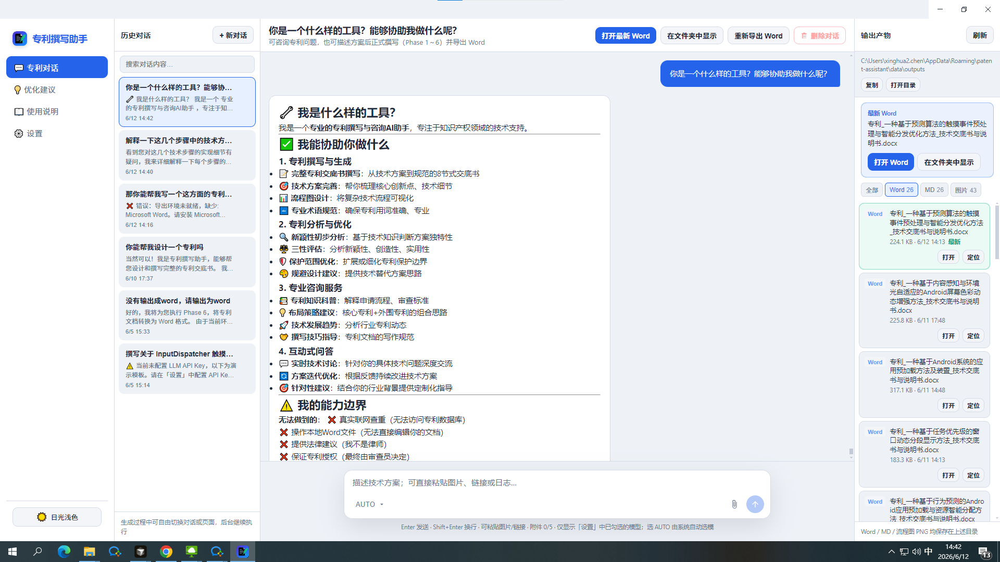
      <br/><em>“What kind of tool are you?” — drafting, analysis, consulting, Q&A</em>
    </td>
    <td align="center" width="50%">
      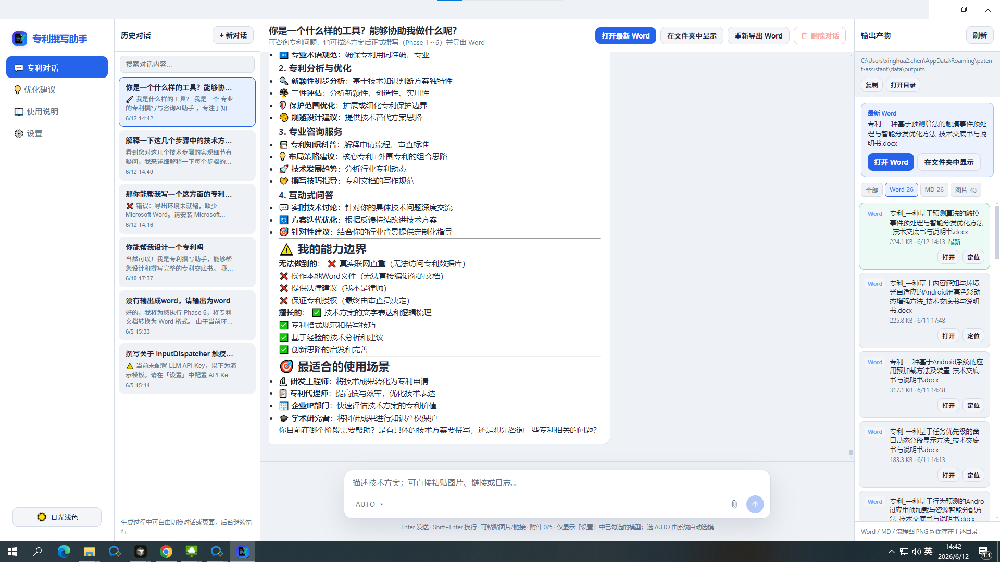
      <br/><em>Boundaries + engineers, agents, corporate IP, researchers</em>
    </td>
  </tr>
</table>

**Tech Q&A · ideas · casual chat**

<table align="center" width="100%">
  <tr>
    <td align="center" width="33%">
      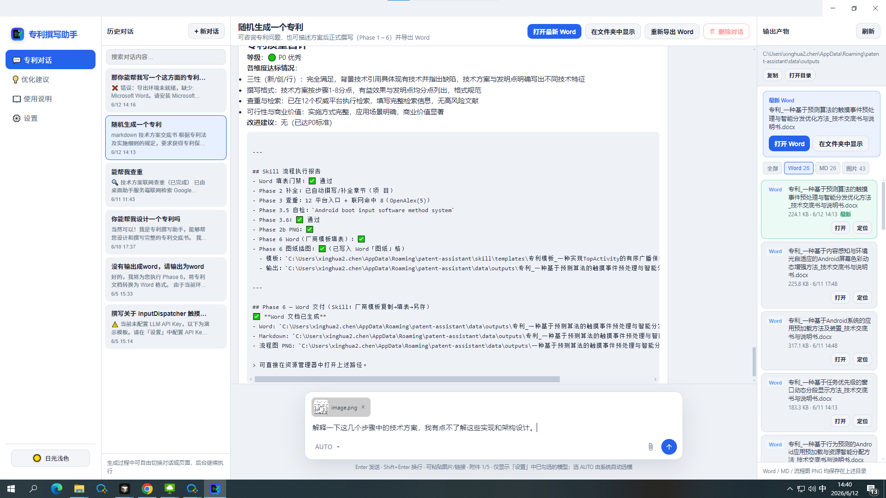
      <br/><em>Step-by-step explanation with flowchart screenshot</em>
    </td>
    <td align="center" width="33%">
      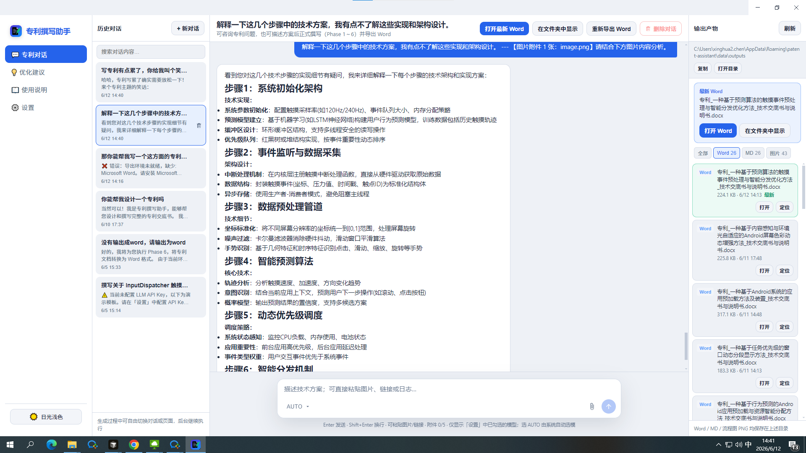
      <br/><em>Layers, algorithms, module responsibilities</em>
    </td>
    <td align="center" width="33%">
      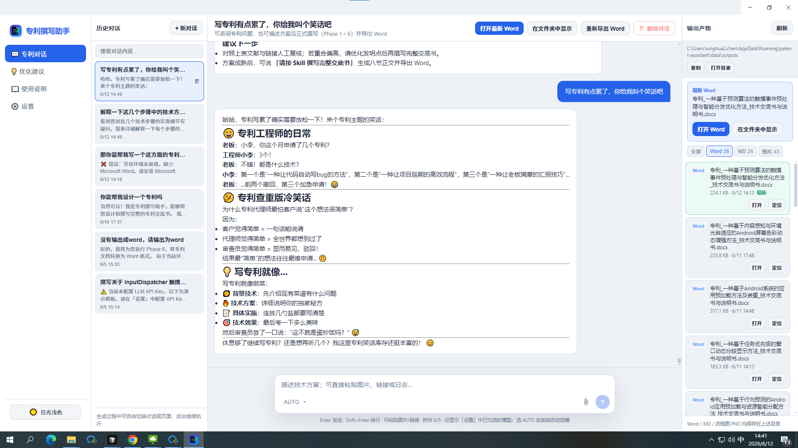
      <br/><em>Casual chat in the same window</em>
    </td>
  </tr>
</table>

<p align="center">
  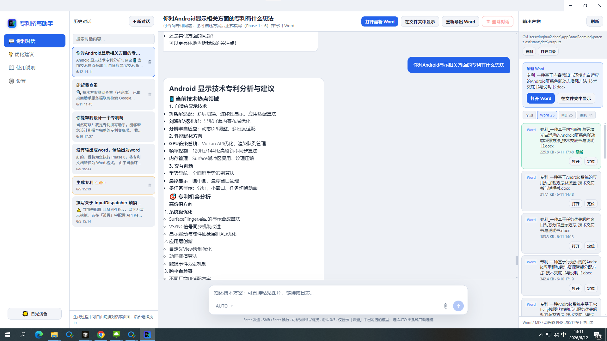
</p>
<p align="center"><em>“Ideas for Android display patents?” — hotspots & opportunities without full drafting</em></p>

### Patent drafting — Skill pipeline

<table align="center" width="100%">
  <tr>
    <td align="center" width="50%">
      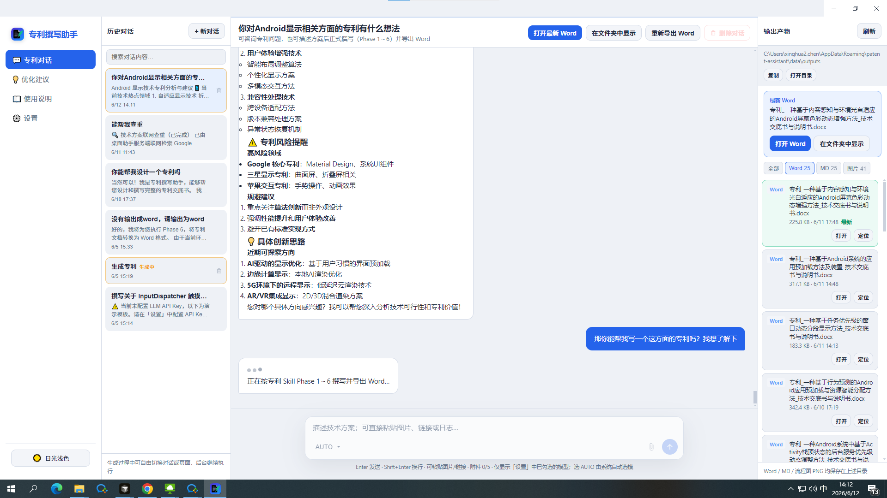
      <br/><em>Phases 1–6: search, overlap check, Word export progress</em>
    </td>
    <td align="center" width="50%">
      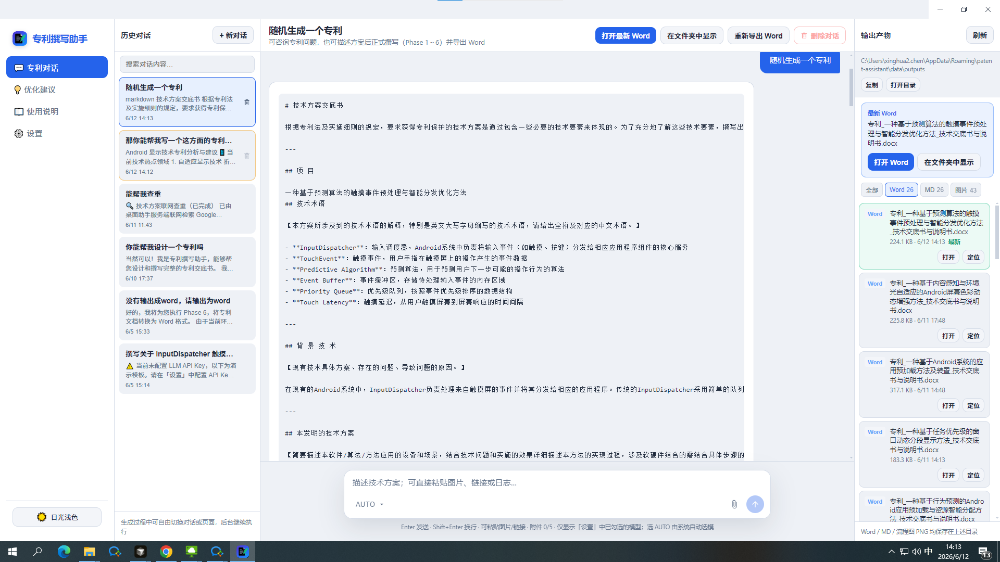
      <br/><em>8-section disclosure preview in chat</em>
    </td>
  </tr>
</table>

### Settings · guide · feedback

<table align="center" width="100%">
  <tr>
    <td align="center" width="33%">
      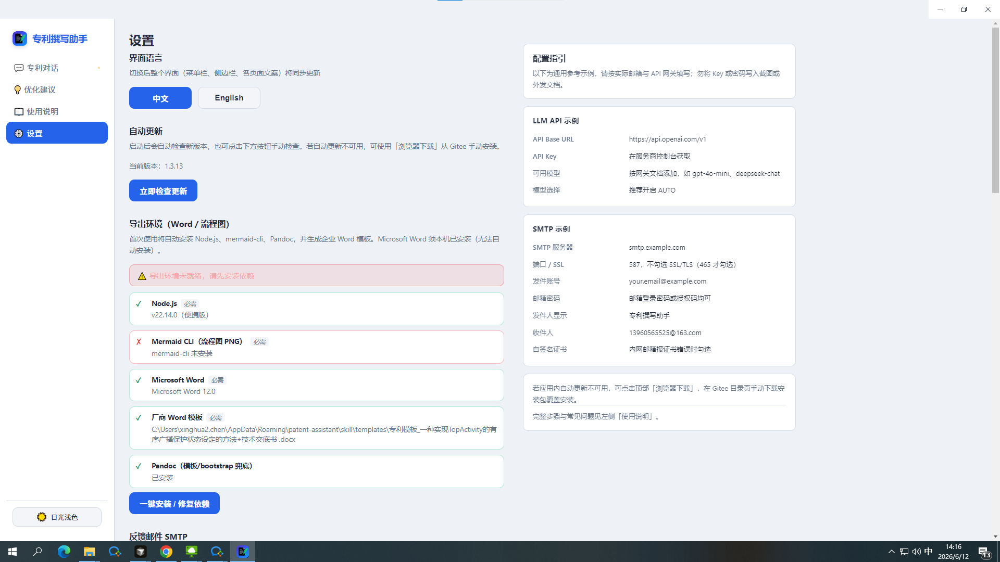
      <br/><em>Export environment check & one-click fix</em>
    </td>
    <td align="center" width="33%">
      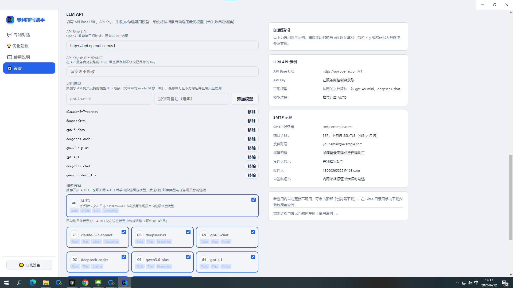
      <br/><em>API / models / AUTO routing</em>
    </td>
    <td align="center" width="33%">
      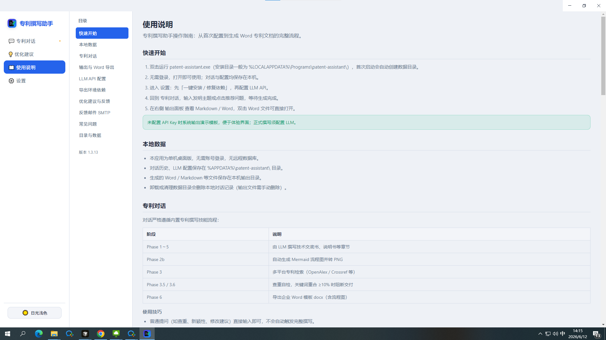
      <br/><em>In-app guide</em>
    </td>
  </tr>
</table>

### Output panel

<table align="center" width="100%">
  <tr>
    <td align="center" width="33%">
      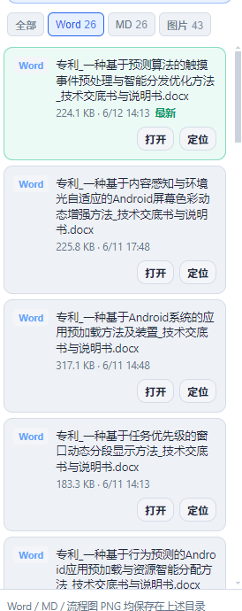
      <br/><em>Word deliverables · Open / Locate</em>
    </td>
    <td align="center" width="33%">
      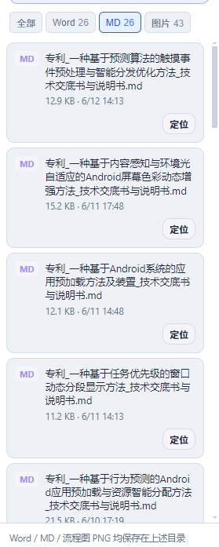
      <br/><em>Full Markdown</em>
    </td>
    <td align="center" width="33%">
      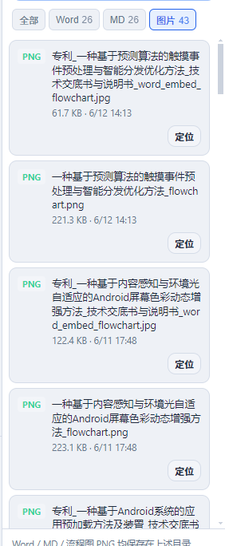
      <br/><em>Flowchart PNG / Word embed JPG</em>
    </td>
  </tr>
</table>

### Sample deliverables

Case: **“Touch event preprocessing and intelligent dispatch optimization based on prediction algorithms”**

| Artifact | Path |
|----------|------|
| Markdown | [`sample-touch-disclosure.md`](docs/images/sample-touch-disclosure.md) |
| Word | [`sample-touch-disclosure.docx`](docs/images/sample-touch-disclosure.docx) |
| Flowchart | [`sample-touch-flowchart.jpg`](docs/images/sample-touch-flowchart.jpg) |

<p align="center">
  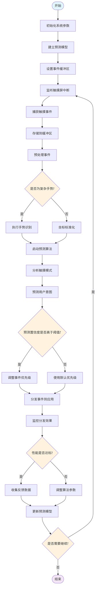
</p>

**Word technical disclosure (WPS / Microsoft Word):**

<table align="center" width="100%">
  <tr>
    <td align="center" width="50%">
      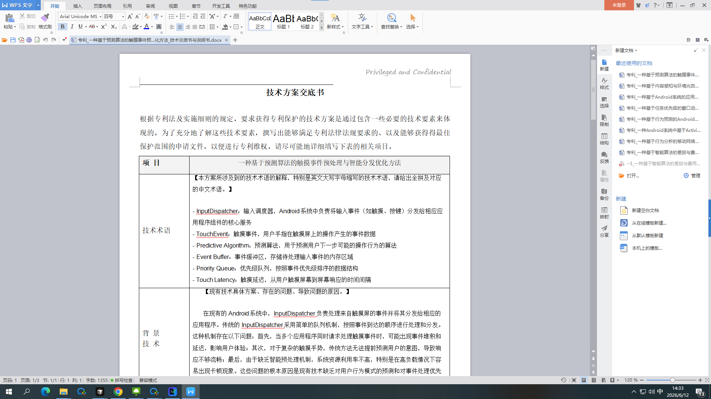
      <br/><em>Technical terms · Background</em>
    </td>
    <td align="center" width="50%">
      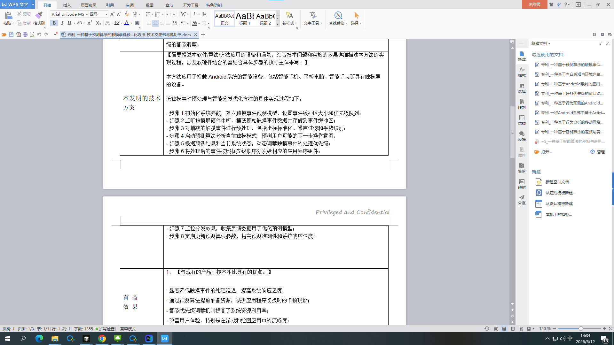
      <br/><em>Technical solution · Beneficial effects</em>
    </td>
  </tr>
  <tr>
    <td align="center" width="50%">
      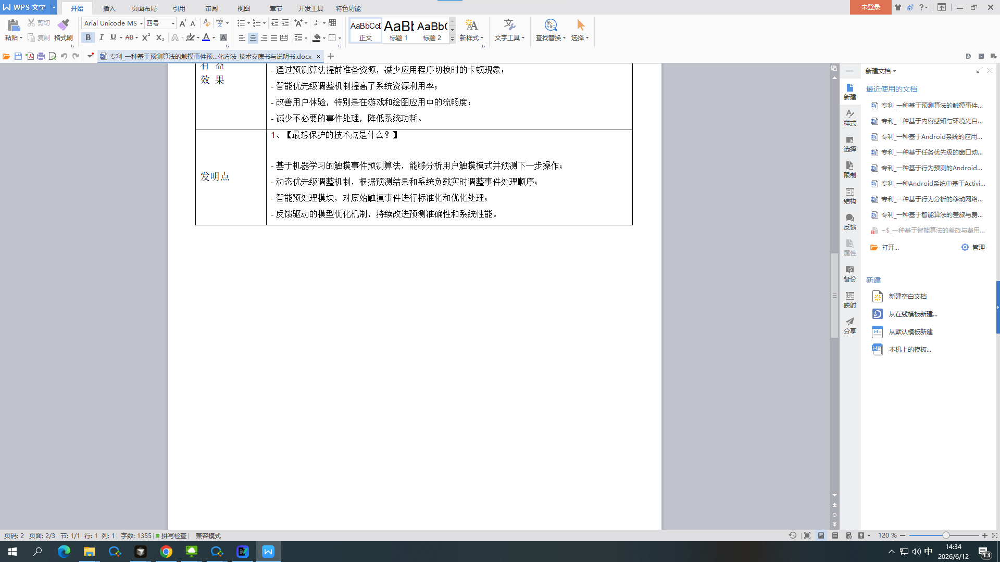
      <br/><em>Invention points · Protection focus</em>
    </td>
    <td align="center" width="50%">
      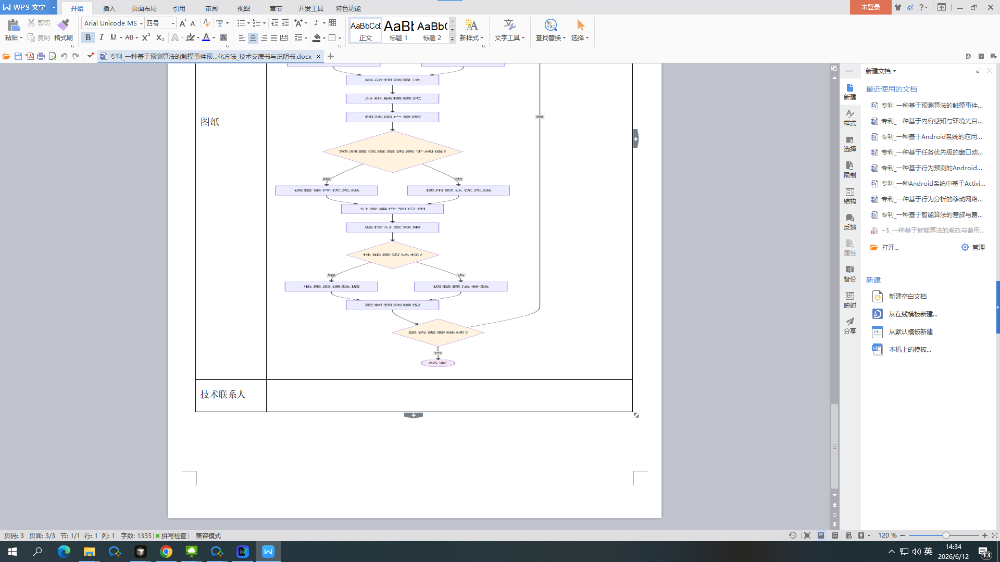
      <br/><em><strong>「图纸」</strong> field with embedded flowchart</em>
    </td>
  </tr>
</table>

<p align="center">
  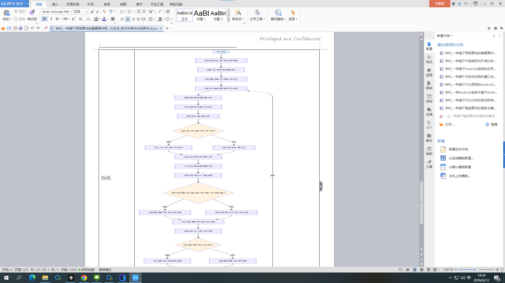
</p>

More excerpts in [`docs/samples/`](docs/samples/).

---

## Architecture

```
┌─────────────────────────────────────────────────────────────┐
│  Electron shell (window / menu / tray / auto-update)          │
│  Embedded Express API  127.0.0.1:3847 (localhost only)      │
└───────────────────────────┬─────────────────────────────────┘
                            │
┌───────────────────────────▼─────────────────────────────────┐
│  React frontend                                              │
│  Chat │ Feedback │ Guide │ Settings                            │
└───────────────────────────┬─────────────────────────────────┘
                            │
┌───────────────────────────▼─────────────────────────────────┐
│  Intent routing + Patent Skill (server/patent)               │
│  chat / consult / prior_art_search / patent_draft / export   │
│  LLM routing │ attachments │ SQLite sessions                   │
└───────────────────────────┬─────────────────────────────────┘
                            │
┌───────────────────────────▼─────────────────────────────────┐
│  Local data  %APPDATA%\patent-assistant\                      │
│  .env │ llm-models.json │ data/outputs/ │ skill/             │
└─────────────────────────────────────────────────────────────┘
```

| Layer | Stack |
|-------|--------|
| Desktop | Electron 34 |
| Frontend | React 18 + Vite |
| Backend | Express + better-sqlite3 |
| Export | mermaid-cli + Pandoc + PowerShell + Microsoft Word |
| Updates | Gitee `latest.yml` + Release installer |

**Patent Skill phases:**

| Phase | Role |
|-------|------|
| Phase 1–5 | LLM drafts 8-section disclosure & specification |
| Phase 2b | Mermaid → PNG flowchart |
| Phase 3 / 3.5 | OpenAlex, Crossref, Google Patents, etc. |
| Phase 3.6 | Overlap gate (may block Word if overlap too high) |
| Phase 6 | Vendor Word template fill + embedded drawing |

---

## Installation

### Requirements

| Item | Requirement |
|------|-------------|
| OS | Windows 10 / 11, **64-bit** |
| Word | **Microsoft Word** (required for Phase 6) |
| Network | LLM calls, prior-art search, dependency downloads |
| LLM | Any **OpenAI-compatible** HTTP API |

### Download & install

| Source | Location |
|--------|----------|
| [`release/`](release/) | After clone: **`release/PatentAssistant-Setup-1.3.13.exe`** |
| [Gitee Releases](https://gitee.com/quanzhouuniversity/patent-writing-assistant/releases) | Download the same exe from release attachments |

1. Run `PatentAssistant-Setup-1.3.13.exe`  
2. If SmartScreen warns: **More info → Run anyway**  
3. Default install: `%LOCALAPPDATA%\Programs\patent-assistant\` (`C:\Users\<you>\AppData\Local\Programs\patent-assistant\`)  
4. Launch **Patent Writing Assistant** from Start menu or `patent-assistant.exe`

### Path cheat sheet

| Purpose | Path | Notes |
|---------|------|-------|
| **Installer (from repo)** | [`release/PatentAssistant-Setup-1.3.13.exe`](release/PatentAssistant-Setup-1.3.13.exe) | Open `release/` after `git clone` |
| **Installer (online)** | [Gitee Releases](https://gitee.com/quanzhouuniversity/patent-writing-assistant/releases) | Pick **v1.3.13** or latest; download `PatentAssistant-Setup-*.exe` |
| **Installed app** | `%LOCALAPPDATA%\Programs\patent-assistant\` | Main binary: `patent-assistant.exe` |
| **Generated outputs** | `%APPDATA%\patent-assistant\data\outputs\` | e.g. `C:\Users\<you>\AppData\Roaming\patent-assistant\data\outputs\` |
| **Config & data** | `%APPDATA%\patent-assistant\` | `.env`, `llm-models.json`, session DB, etc. |

**In-app shortcuts (recommended):**

- Chat → **Output** panel → **Open folder** / per-file **Open** / **Locate**  
- Chat header → **Open latest Word** / **Show in folder**

> In Explorer, paste `%APPDATA%\patent-assistant\data\outputs` and press Enter.

### First-time setup (~10 min)

```
① Settings → Export environment → One-click install / repair
② Settings → LLM API → Base URL, Key, models, enable AUTO, Save
③ Chat → try consulting, prior-art check, or drafting
④ After drafting → Output panel → open .docx and verify 「图纸」 drawing
```

| LLM field | Example |
|-----------|---------|
| API Base URL | `https://api.openai.com/v1` |
| API Key | From your provider |
| Models | `gpt-4o-mini`, `deepseek-chat`, etc. |

> Without an API key you can explore the UI and demo templates; production use requires LLM setup.

### Updates

- **In-app:** Settings → Check for updates  
- **Manual:** [Gitee Releases](https://gitee.com/quanzhouuniversity/patent-writing-assistant/releases) or replace installer in `release/`  

Update source: `https://gitee.com/quanzhouuniversity/patent-writing-assistant`

---

## Usage

### Sidebar

| Entry | Function |
|-------|----------|
| 💬 **Chat** | Main workspace: consult, check, draft, chat, outputs |
| 💡 **Feedback** | Issues / suggestions; optional SMTP email |
| 📖 **Guide** | In-app manual |
| ⚙️ **Settings** | Language, updates, export env, LLM, SMTP |

### Example prompts

**① Full patent drafting**

```
Draft an invention patent for touch event preprocessing and intelligent
dispatch optimization based on prediction algorithms.

Key points: InputDispatcher dispatch; TouchEvent preprocessing & prediction;
priority queue; lower touch latency.
```

**② Standalone prior-art check**

```
Prior-art check: A method for touch event preprocessing and intelligent
dispatch optimization, including event buffer, prediction model,
priority queue, and intelligent dispatch module.
```

**③ Consulting / brainstorming**

```
Any patent ideas around Android display technology?
```

```
Explain the architecture behind "is prediction confidence above threshold" in this flowchart.
```
(attach image 📎)

**④ Casual chat**

```
I'm tired of writing patents — tell me a joke.
```

### Tips

- **Enter** send, **Shift+Enter** newline  
- 📎 Images, logs, PDF, Word, archives  
- Prefer **AUTO** model; jobs continue in background when you switch views  
- Header: **Open latest Word** / **Show in folder**  

### Output files

Default: **`%APPDATA%\patent-assistant\data\outputs\`** (see [Path cheat sheet](#path-cheat-sheet))

| File | Description |
|------|-------------|
| `专利_<title>_技术交底书与说明书.md` | Full Markdown |
| `专利_<title>_…_章节提取.json` | Structured sections |
| `<title>_flowchart.mmd` / `.png` | Flowchart source & image |
| `专利_<title>_技术交底书与说明书.docx` | Word deliverable |

### FAQ

| Issue | Fix |
|-------|-----|
| No flowchart in Word | Settings → repair deps; ensure Word is installed |
| MD only, no DOCX | Export env not ready or Phase 6 not reached |
| Blocked by overlap check | Increase differentiation; run standalone check first |
| Empty model list | Settings → add models and save |
| Chat triggered drafting | Shorter text, add `?`, or say “just chat, no disclosure” |
| Can’t find installer or outputs | [Path cheat sheet](#path-cheat-sheet); or **Open folder** in app |

---

## Contributing

1. **Fork** [patent-writing-assistant](https://gitee.com/quanzhouuniversity/patent-writing-assistant)  
2. Create branch `Feat_xxx`  
3. Submit under **GPL-3.0**  
4. Open Pull Request  

**Contact:** [13960565525@163.com](mailto:13960565525@163.com) · in-app **💡 Feedback**

---

## Standout features

| # | Feature | Description |
|---|---------|-------------|
| 1 | **Dual-mode agent** | Patent Skill + consult / chat / prior-art; auto intent |
| 2 | **8-section disclosure + Word** | Vendor table layout; auto drawing embed |
| 3 | **Standalone prior-art check** | One command, multi-platform + overlap |
| 4 | **≥12 search platforms** | Google Patents, EPO, PSS, SooPat, Lens, … |
| 5 | **Overlap gate** | Phase 3.6 may block Word delivery |
| 6 | **AUTO routing** | Vision / reasoning / fast by task |
| 7 | **Multimodal attachments** | Images, logs, PDF, Word, archives |
| 8 | **Output panel** | Word / MD / images by tab |
| 9 | **Local + your LLM** | No SaaS lock-in; private gateways OK |
| 10 | **Themes + bilingual** | Dark / light; 中文 / English UI |
| 11 | **Dependency repair** | Node, mermaid-cli, Pandoc, template |
| 12 | **Auto-update** | Gitee `latest.yml` + Release |

---

## Build from source

```powershell
git clone https://gitee.com/quanzhouuniversity/patent-writing-assistant.git
cd patent-desktop
npm install
npm run dev          # development
npm run build        # installer → dist\
```

Copy the installer to [`release/`](release/) for distribution. Maintainers: [`build/PUBLISH.md`](build/PUBLISH.md).

---

## If this helped you

This project is free and open source. If it saved you time on patents, research, or daily consulting:

- **Star** the [Gitee repo](https://gitee.com/quanzhouuniversity/patent-writing-assistant) so others can find it  
- Optionally tip the author via Alipay **`13960565525`** (any amount, entirely voluntary; tipping does not unlock anything extra)

Stars and feedback matter more than tips. Thank you for using it.

---

## License

Copyright © 2026 **Xinghua Chen** &lt;13960565525@163.com&gt;

Released under **[GNU GPL v3.0](LICENSE)**, consistent with the [Gitee repository](https://gitee.com/quanzhouuniversity/patent-writing-assistant).

<p align="center">
  <strong>AI Patent Writing Assistant — Patent Skill Desktop</strong><br/>
  Patent Assistant Desktop · v1.3.13
</p>
